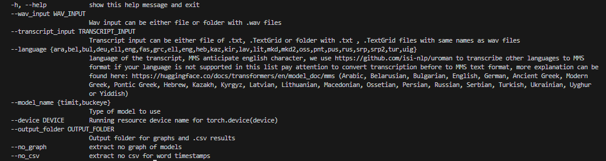
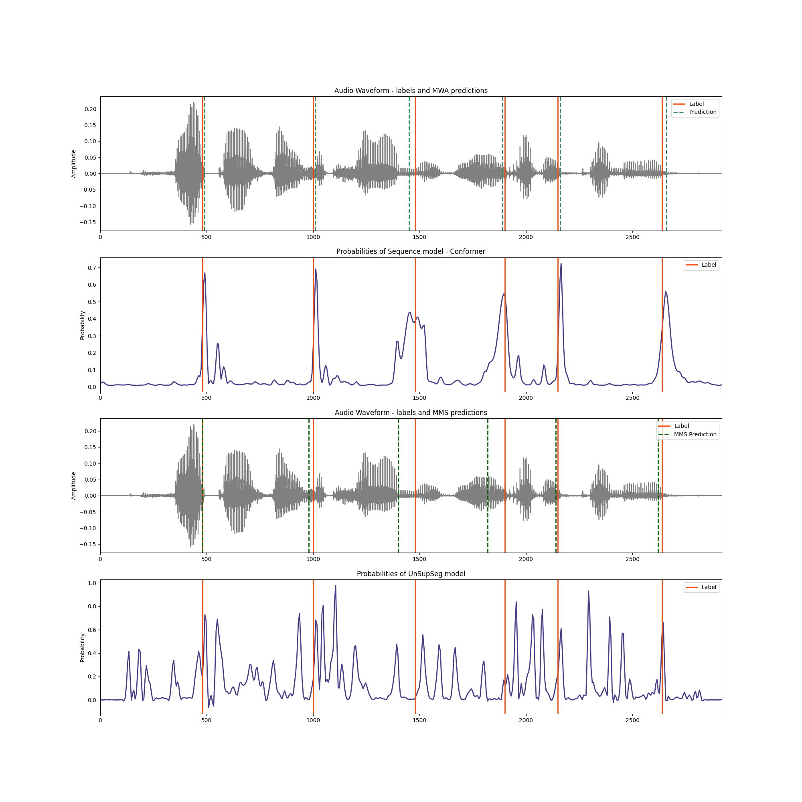

# Mwa

## Paper
We present the MWA - Multi Word Aligner , a new open source model for speech-text alignment. We developed an ensemble-based word - alignment algorithm composed of several state-of-the-art speech representation models. The selected representation from these models is fed into a neural sequence model - Conformer, which then outputs frame-wise probabilities at a 10ms resolution. Finally, dynamic programming is used to perform the final alignment, refining the boundaries and ensuring accurate word segmentation. We compared the proposed model to the leading speech-text aligners model today using TIMIT and Buckeye corpora. Results suggest that out model surpasses all the leading models and reaches state-of-the-art performance on both data sets. Furthermore, we evaluated the resulting model on languages that were not seen during the training phase (Hebrew and Dutch).

Licenses:
```bash
This is from Felix we need to 
@article{kreuk2020self,
  title={Self-Supervised Contrastive Learning for Unsupervised Phoneme Segmentation},
  author={Kreuk, Felix and Keshet, Joseph and Adi, Yossi},
  journal={arXiv preprint arXiv:2007.13465},
  year={2020}
}
```

## Clone repository
```bash
git clone 
```

## Setup environment
```bash
conda create --name Mwa_venv --file requirements.txt 
conda activate Mwa_venv
```

## MWA Usage




| Argument                  | Type   | Description                                                                       
| ---------------------     | ------ | ---------------------------------------------------------------------------------------------------------------------------------------  
| `--wav_input`             | `str`  | 📂 Path to the folder containing `.wav` audio files or file with .wav posix.
| `--transcript_input`      | `str`  | 📂 Path to the folder containing transcription files (e.g., `.txt`, `.csv`). (or text file)
| `--output_folder`         | `str`  | 📁 Directory where results will be saved. Will be created if it doesn't exist. In order to disable result type use --no_graph or --no_csv additional flags
| `--language`              | `str`  | 🌍 (Optional) Language code for processing. see in the --help option for additional details Default: `eng`.
| `--model_name`            | `str`  | 🤖 timit/buckeye models are supported - timit model was trained on genre of spoken language and buckeye on fluent speech (conversation)
| `--device`                | `str`  | 🖥️ in case GPU resources are available you can use device name ("cuda:0")  to improve performances
| `--no_graph, --no_csv`    | `str`  | 🐞 flags to disable option in your results

<!-- 
The tool is easy to use:

wav_input - is the folder for the wav files you want to align

transcript_input - is the folder for the transcript files you want to align, pay attention that wav files names and transcripts files names should be the same apart from the posix

language - MWA is multilingual and support the languages of MMS (1107 languages) in order to use other language, use the language prefix as described in the --help section
if you can't find your language in the option below and you can transform your language to english character we recommend trying it and it should align the text in a good way

model_name - timit/buckeye models are available - timit model was trained on read ganre and buckeye over more fluent speech (conversation)

device - in case GPU resources can be used device as "cuda:0" can be used to improve performances

output_folder - script will extract csv with times for each word and also graph showing the model performances, in order to disable one of them use --no_graph or --no_csv additional flags -->

```bash
Input example:
python --wav_input "your_folder/Mwat/examples/" --transcript_input "your_folder/Mwat/examples/" --language "eng" --model_name "timit" --device "cuda:2" --output_folder "results"

Or:
python --wav_input "your_folder/Mwat/examples/english.wav" --transcript_input "your_folder/Mwat/examples/english.txt" --language "eng" --model_name "buckeye" --output_folder "results"
python --wav_input "your_folder/Mwat/examples/english.wav" --transcript_input "your_folder/Mwat/examples/english.TextGrid" --language "eng" --model_name "timit" --device "cuda:2"

Or:
python --wav_input "your_folder/Mwat/examples/german.wav" --transcript_input "your_folder/Mwat/examples/german.txt" --language "deu" --model_name "timit" --output_folder "results"
```

## Illustration

